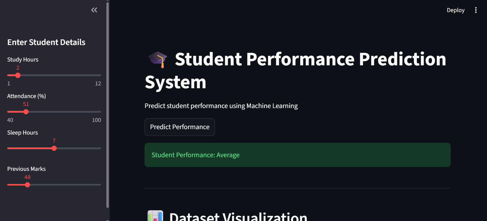
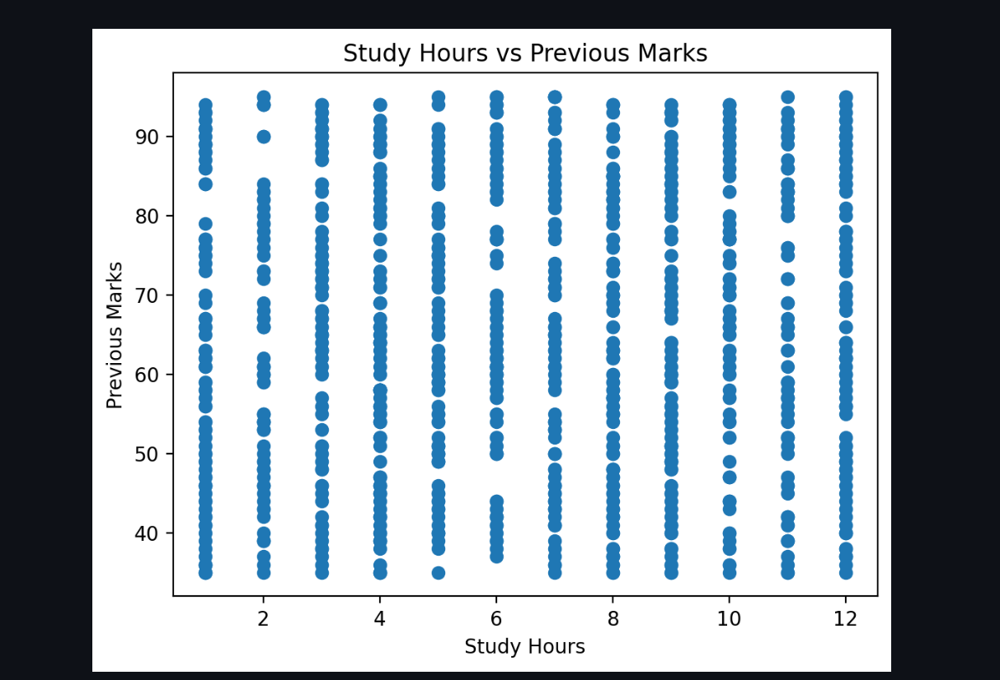
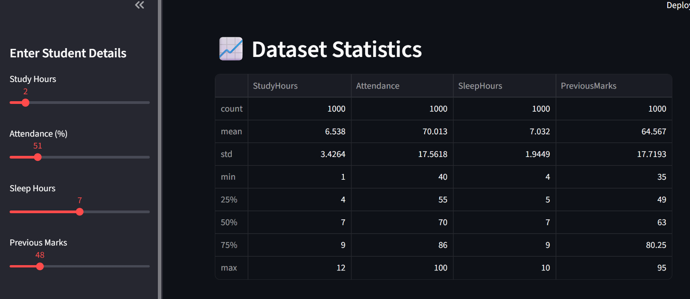

# 🎓 Student Performance Prediction System

An intelligent Machine Learning web application that predicts student performance using academic and behavioral data. This project uses a Random Forest Classifier to analyze factors such as study hours, attendance, sleep hours, and previous marks to classify students into performance categories like Excellent, Good, Average, and Poor.

Built with Python and Streamlit, the system provides an interactive dashboard for real-time predictions, data visualization, and statistical analysis.

---

# 🚀 Features

✅ Student Performance Prediction
✅ Random Forest Classification Model
✅ Interactive Streamlit Dashboard
✅ Real-Time Predictions
✅ Dataset Visualization
✅ Statistical Analysis
✅ Performance Distribution Charts
✅ Automatic Dataset Generation (1000+ Records)
✅ User-Friendly Interface

---

# 🛠 Technologies Used

* Python
* Pandas
* NumPy
* Matplotlib
* Scikit-learn
* Streamlit
* Joblib

---

# 🧠 Machine Learning Algorithm

## 🌲 Random Forest Classifier

Random Forest is an ensemble Machine Learning algorithm that combines multiple decision trees to improve prediction accuracy and reduce overfitting.

The model predicts student performance categories based on:

* Study Hours
* Attendance
* Sleep Hours
* Previous Marks

---

# 📂 Project Structure

```plaintext id="mjlwm8"
Student-Performance-System/
│
├── images/
│   ├── dashboard.png
│   ├── dataset.png
│   ├── graph.png
│   └── statistics.png
│
├── generate_dataset.py
├── student_data.csv
├── train_model.py
├── app.py
├── model.pkl
├── requirements.txt
└── README.md
```

---

# 📸 Project Screenshots

## 🏠 Dashboard



---

## 📊 Dataset Visualization


---

## 📈 Graph Analysis



---

## 📋 Dataset Statistics



---

# ⚙️ Installation

## 1️⃣ Clone Repository

```bash id="1nfr8m"
git clone https://github.com/your-username/student-performance-system.git
```

---

## 2️⃣ Open Project Folder

```bash id="cjlwmr"
cd student-performance-system
```

---

## 3️⃣ Install Dependencies

```bash id="fcjlwm"
pip install -r requirements.txt
```

---

# ▶️ Running the Project

## Step 1: Generate Dataset

```bash id="ywjlwm"
python generate_dataset.py
```

---

## Step 2: Train Model

```bash id="3jlwmx"
python train_model.py
```

This creates:

```plaintext id="njlwmq"
model.pkl
```

---

## Step 3: Run Streamlit Application

```bash id="zjlwm1"
streamlit run app.py
```

---

# 🎯 Prediction Categories

| Performance | Meaning                          |
| ----------- | -------------------------------- |
| Excellent   | Outstanding Academic Performance |
| Good        | Above Average Performance        |
| Average     | Moderate Performance             |
| Poor        | Needs Improvement                |

---

# 📊 Dashboard Functionalities

* 🎓 Student Input System
* 📈 Performance Prediction
* 📋 Dataset Display
* 📊 Visualization Charts
* 📉 Statistical Analysis
* 🌟 Interactive User Interface

---

# 🔥 Future Improvements

* User Authentication
* Cloud Deployment
* AI Study Recommendations
* PDF Report Generation
* Database Integration
* Advanced Analytics Dashboard
* Dark/Light Theme

---

# ☁️ Deployment Platforms

Deploy easily on:

* [Streamlit Cloud](https://streamlit.io/cloud?utm_source=chatgpt.com)
* [Render](https://render.com?utm_source=chatgpt.com)
* [Railway](https://railway.app?utm_source=chatgpt.com)
* [Hugging Face Spaces](https://huggingface.co/spaces?utm_source=chatgpt.com)

---

# 📦 Requirements

```plaintext id="4jlwmz"
streamlit
pandas
numpy
matplotlib
scikit-learn
joblib
```

---

# 🎓 Learning Outcomes

This project helps in understanding:

* Machine Learning Classification
* Data Preprocessing
* Random Forest Algorithm
* Data Visualization
* Dashboard Development
* Model Deployment Basics

---

# 🏆 Project Highlights

✅ End-to-End Machine Learning Project
✅ Interactive AI Dashboard
✅ Real-Time Prediction System
✅ Visualization & Analytics
✅ Beginner-to-Intermediate Level Project
✅ Portfolio & Resume Ready

---

# 👨‍💻 Author

Developed as a Machine Learning and Data Science project for academic learning and portfolio development.

---

# ⭐ Conclusion

The Student Performance Prediction System demonstrates how Machine Learning can be applied in education to analyze student behavior and predict academic performance using intelligent classification techniques. It combines Data Science, Machine Learning, Visualization, and Web Development into one complete AI-powered application.
